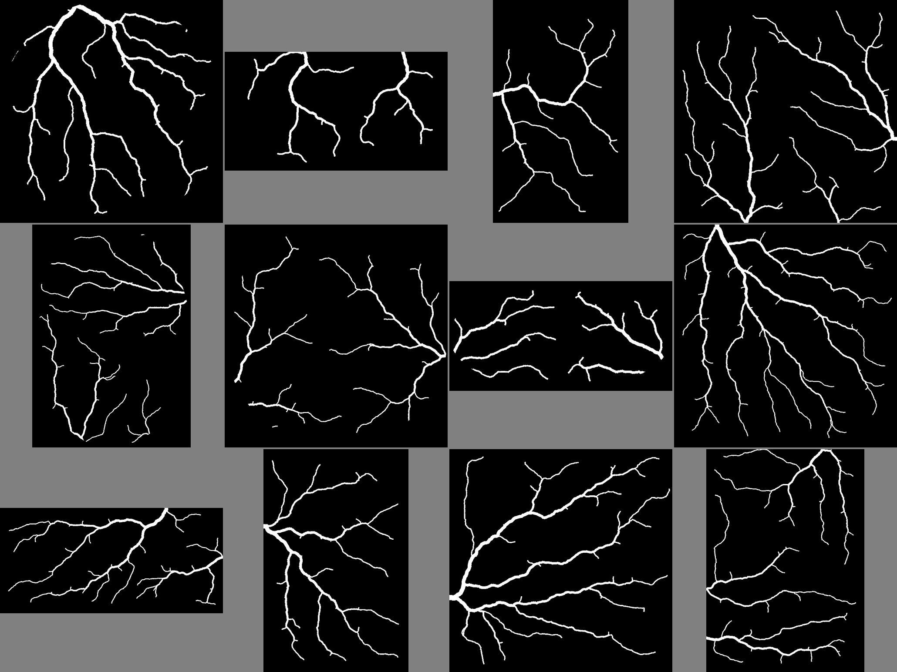
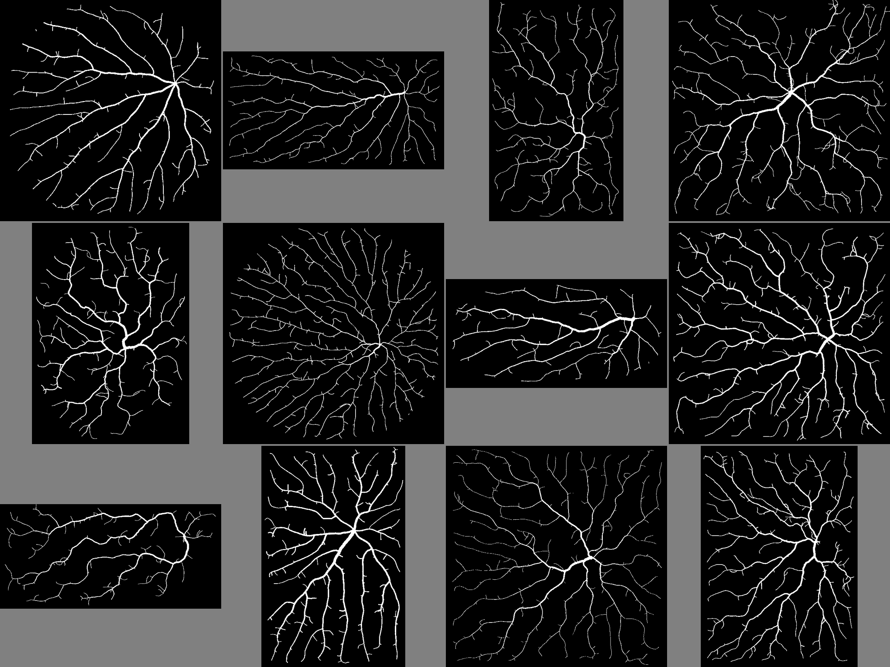
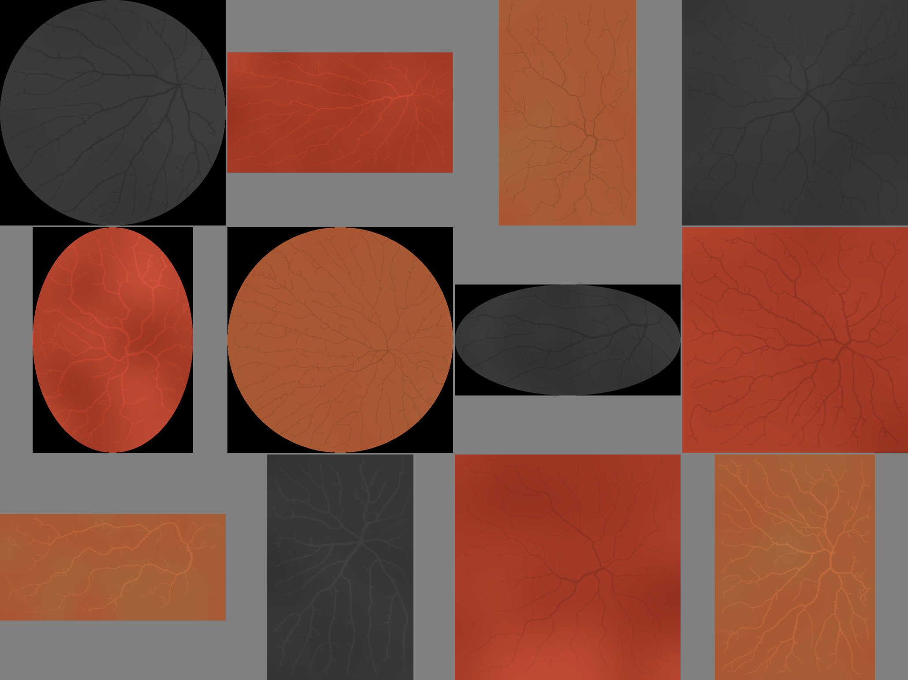
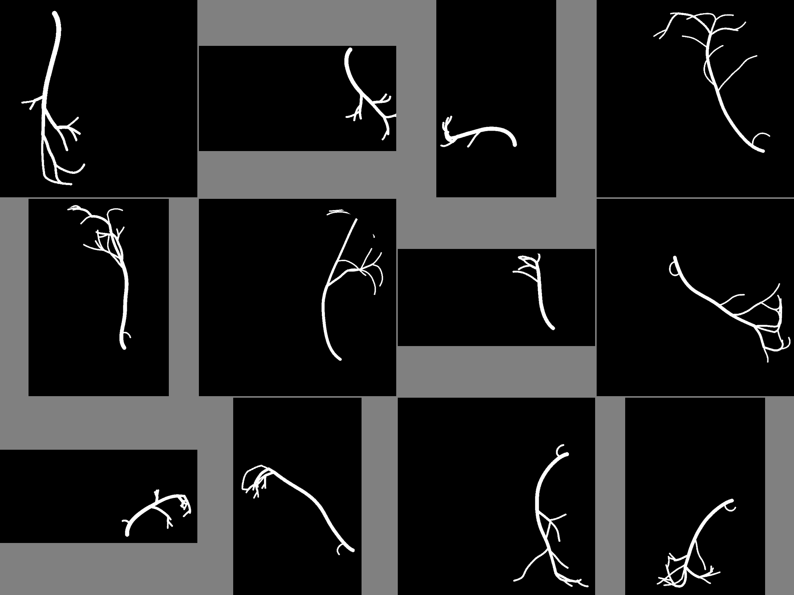
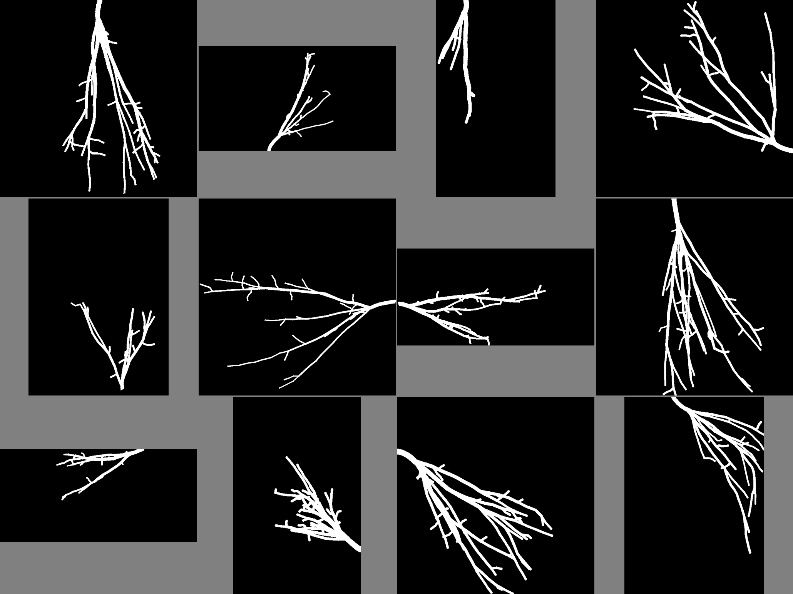
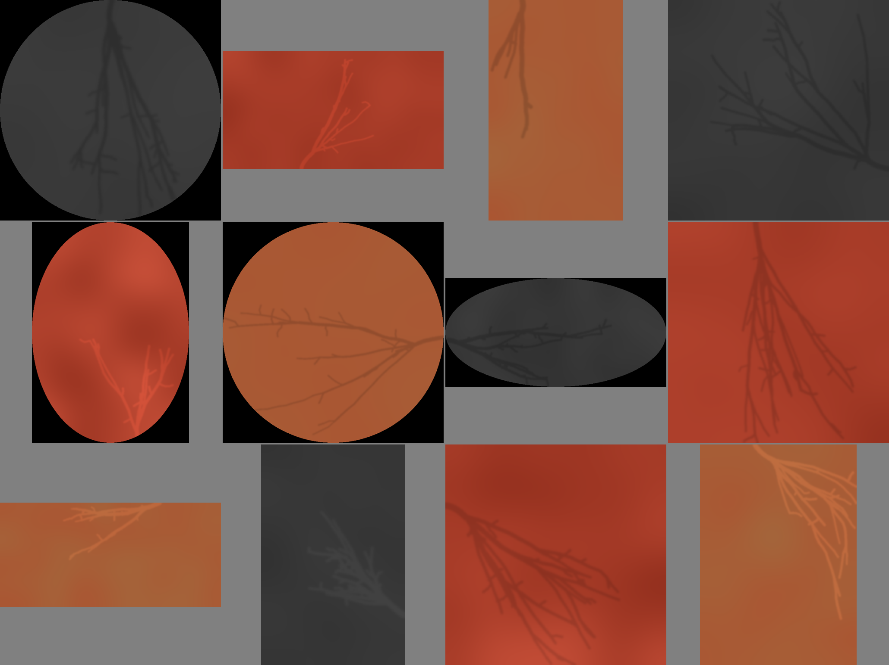
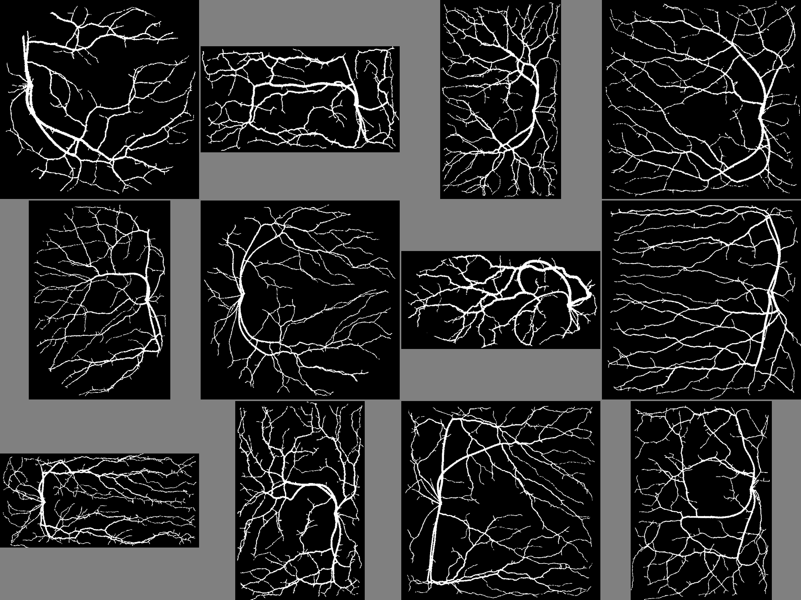

# procedural-vessel-generation

Procedural generator for synthetic blood-vessel segmentation data. Each sample is a binary ground-truth mask (vessel = 1, background = 0) plus a colored input image.

## Usage

```bash
pip install -r requirements.txt
python3 generate_vessels.py v5        # 12 samples of one version
python3 generate_vessels.py mix -n 20 # even split across v1-v5
```

Output goes to `examples/<preset>/`:

- `<name>.png` / `<name>.npy`: ground-truth mask
- `<name>_input.png`: colored input image
- `contact_sheet.png`, `contact_sheet_input.png`: previews

## Versions

| Version | Style | Method |
|---|---|---|
| v1 | Sparse branching trees from the canvas edge | Space colonization, few attractors |
| v2 | Dense radial network from a central origin | Space colonization with curl, arcs and sprouts |
| v3 | Coronary: one thick curving trunk, distal branches, proximal hook | Curvature-controlled random walks |
| v4 | Fan: short trunk splitting into near-parallel angular branches with twigs | Polyline walks with splits and twigs |
| v5 | Retina: optic disc, arcades around a vessel-free macula, artery/vein crossings | Arcade walks + two-tree space colonization + edge roughening |

All versions share:

- Random canvas shape and size: circle, oval, square or rectangle, 320-768 px
- Vessel widths from Murray's law (tapering by downstream leaf count) with random thickness variation

## Generate a sharded dataset

```bash
python generate_dataset.py --out /path/to/vessels -n 10000 --workers 4
```

Each sample has a colored WebP image and a binary PNG mask. Files are sharded into folders of 1,000 samples. `manifest.csv` records the index, preset, seed, canvas shape, dimensions, palette, and vessel fraction. Re-running skips complete samples.

To generate harder examples in a fresh output directory:

```bash
python generate_dataset.py --out /path/to/harder-vessels -n 10000 --workers 4 \
  --res 2 --density 2 --bg-variation 0.15
```

`--res` multiplies canvas dimensions, `--density` increases attractor or branch counts, and `--bg-variation` adds color variation to the background. Their defaults, `1`, `1`, and `0`, preserve the original presets and rendering. Use a new directory when changing generation settings. Worker initialization applies the controls with either fork or spawn multiprocessing.

To write a manifest for a completed prefix while generation continues:

```bash
python partial_manifest.py /path/to/vessels 1000 manifest_first1000.csv
```

The helper requires both image and mask files and reads their actual dimensions, including resized datasets.

## Input images

- Background inside the canvas is a smooth color field within one of three ranges, split evenly across samples:
  - Gray: RGB(47,47,47)-RGB(62,62,62)
  - Red: RGB(210,86,62)-RGB(148,48,30)
  - Orange: RGB(170,85,50)-RGB(164,100,58)
- Vessels are 10-15% darker or brighter than their surroundings (15-20% for gray)
- Vessel edges get a Gaussian blur with sigma = 10% of the widest vessel diameter
- Pixels outside the canvas shape are black

## Previews

| Mask | Input |
|---|---|
|  |  |
|  |  |
|  |  |
|  |  |
|  |  |
